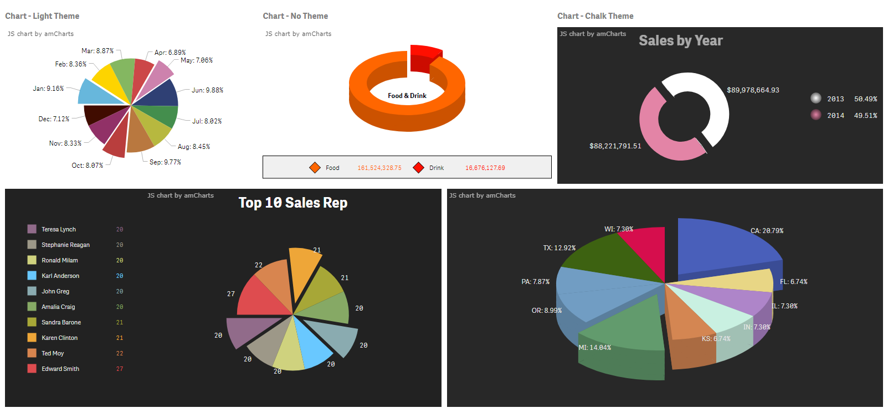

# Qliksense.Extension.amPieChart
Qliksense extension for amPieChart by amChart

## Introduction
While searching for some good charts, I found great charts @ [amCharts](https://www.amcharts.com/).  You can use them for FREE with a watermark, but for a small purchase, the watermark can be removed legally.  

I found a Qliksense extension called amComboChart created by NielsLindberg.  https://github.com/NielsLindberg  A lot of framework was created and I just needed to extend some of the functions to create the amPieChart. So, I give credit to NielsLindberg for his intial work.

It has almost all of the functions that come with amChart Pie.  

You can find them here.  [AmPieChart] (https://docs.amcharts.com/3/javascriptcharts/AmPieChart)

This chart will also work with IE as well with Google Chrome.

## Screen shot

## Download Procedures

Download "Qliksense.Extension.amPieChart-master.zip" file.  

## Installing Extension into Qlik Sense Desktop
Locate .zip file with extension and unzip it. Open the unzipped folder to find another folder "qs-amPieChart" inside. Copy that folder and navigate to documents/qlik/sense/extensions and paste the folder there.  Keep the folder name the same.

## Installing Extension into Qlik Sense Server
Go to your QMC and, in the navigation menu on the left, under “Manage Resources”, click “Extensions”.

Then, in the action bar at the bottom of the screen, click “Import”

Click “Choose File” in the popup and navigate to the folder, "Qliksense.Extension.amPieChart-master.zip" that was downloaded, select it, then click “Import”.

## How to use
Import qs-amPieChart.zip into your qliksense dev-hub extensions folder.  The folder name is IMPORTANT.  If you need to change it, then you will also need to modify the 'qs-amPieChart.js' code here:  

First few lines in the js file.

//Extension folder (change if you rename the extension folder)

var folder = 'qs-amPieChart';

****
 
## Disclaimer
I am not affiliated with amcharts.com. Their library is free to use for commercial purposes with the caveate that you must include the link to their website in the charts (as seen on the top left of the chart screenshots). If you would want a version without links to amcharts.com you would need to purchase a license from amCharts.com.
